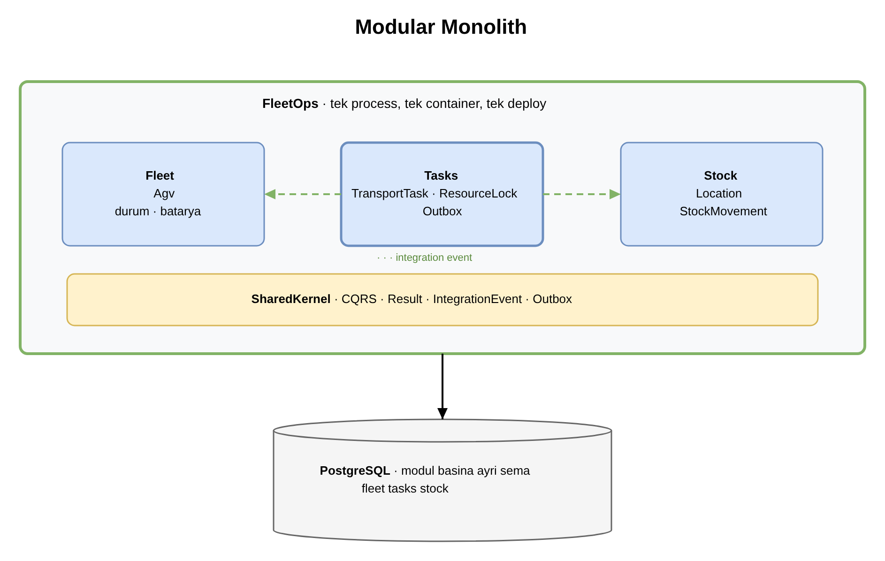
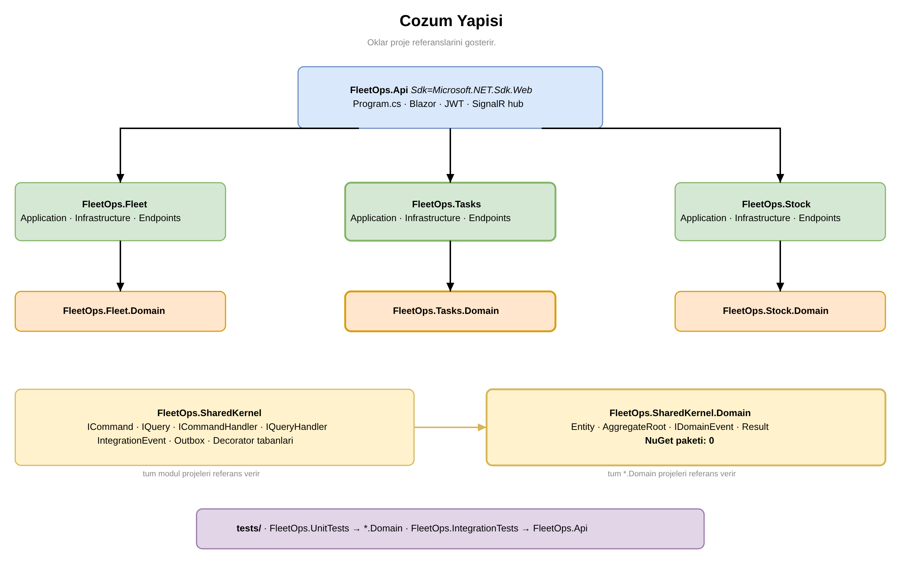
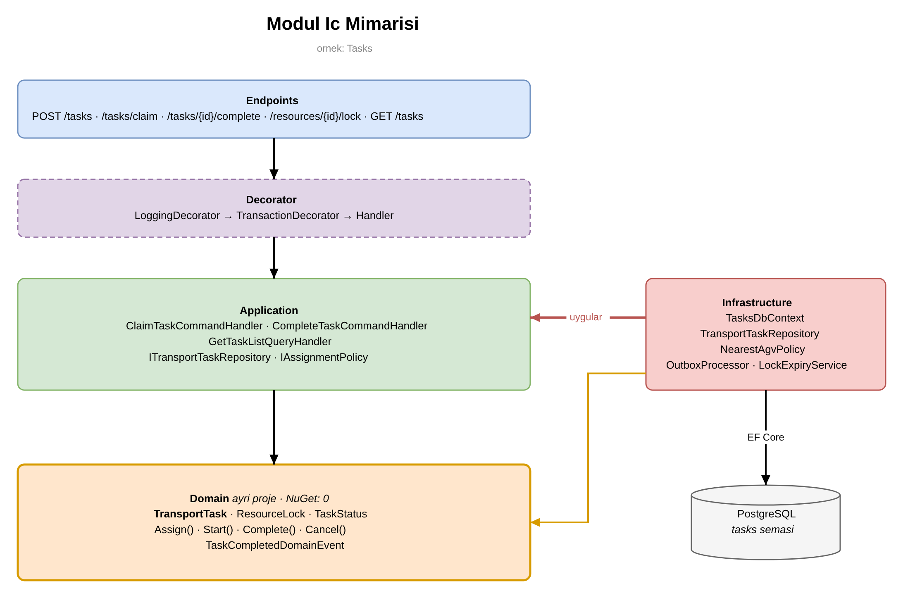
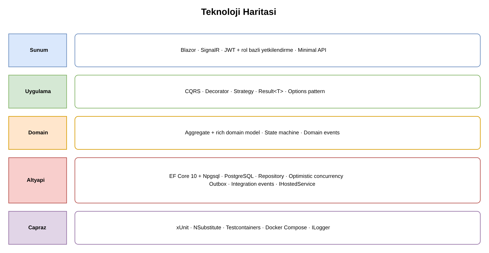
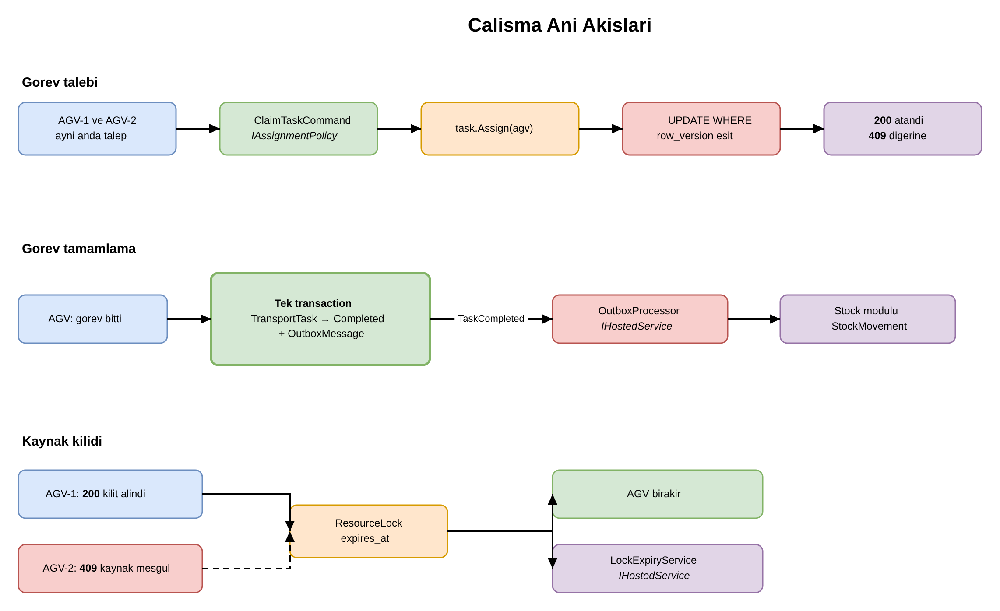

# FleetOps

AGV (Automated Guided Vehicle) filo ve gorev yonetim sistemi.

Fabrika/depo icinde calisan AGV filosunun merkezi yonetimi: gorev havuzu ve atama,
dar koridor/kapi gibi paylasilan kaynaklarin kilitlenmesi, tamamlanan gorevin stok
hareketine donusmesi ve filo durumunun canli izlenmesi.

> **Kapsam disi:** navigasyon, rota planlama, engelden kacinma, motor kontrolu.
> Bunlar aracin kendi yaziliminda kalir. Sistem "nereye gidilecegini" soyler,
> "nasil gidilecegini" degil.

## Mimari

### Cozum yapisi

### Modul ic mimarisi

### Teknoloji haritasi

### Calisma ani akislari

---

**Modular Monolith** — tek deploy birimi, uc bagimsiz modul:

| Modul | Sorumluluk |
|---|---|
| `Fleet` | AGV kayit, durum, batarya |
| `Tasks` | Gorev havuzu, atama, kaynak kilidi, outbox |
| `Stock` | Lokasyon, malzeme hareketi |

Moduller birbirinin `DbContext`'ini gormez, aralarinda foreign key yoktur ve
birbirlerinin handler'larini cagirmazlar. Iletisim yalnizca integration event ile olur.

### Uygulanan pattern'ler

| Pattern | Cozdugu problem |
|---|---|
| Modular Monolith | Stok mantigi ile filo mantigi karismasin |
| CQRS | Yazma aggregate'ten, okuma projeksiyondan |
| Aggregate + rich domain | Gecersiz durum gecisi imkansiz olsun |
| Repository | Aggregate bir butun olarak yuklensin/kaydedilsin |
| Optimistic Concurrency | Gorev/kilit iki kez verilmesin |
| State Machine | Gecisler tek yerde tanimli olsun |
| Strategy | Atama kurali degisebilir olsun |
| Decorator | Log ve transaction handler'i kirletmesin |
| Outbox | Kayit gitti ama olay gitmedi durumu olmasin |
| Integration Events | Moduller birbirini dogrudan cagirmasin |
| Hosted Service | Takili kilitler serbest kalsin |
| Options | Ayarlar koda gomulmesin |

## Teknoloji

| Katman | Teknoloji |
|---|---|
| Runtime | .NET 10 |
| Web/API | ASP.NET Core (Minimal API) |
| Arayuz | Blazor |
| ORM | EF Core 10 |
| Veritabani | PostgreSQL |
| Canli veri | SignalR |
| Kimlik | JWT + rol bazli yetkilendirme |
| Test | xUnit + NSubstitute + Testcontainers |
| Dagitim | Docker + Docker Compose |

