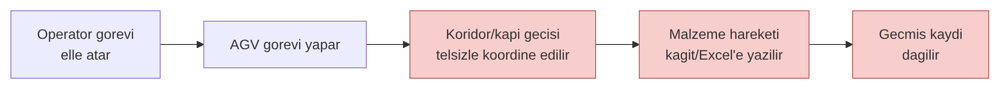
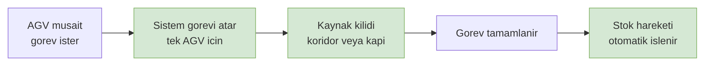
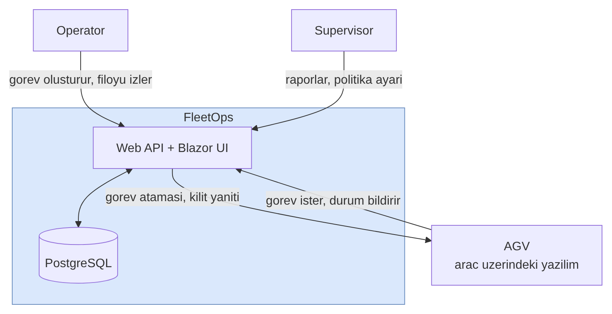

# FleetOps — Business Analysis

**AGV Fleet & Task Management System**

## 1. Problem Tanımı

Fabrika ve depolarda malzeme taşıma işini AGV (Automated Guided Vehicle) filoları yapıyor.
Bu filonun yönetimi — hangi aracın hangi görevi alacağı, dar koridorlardan geçiş sırası,
taşınan malzemenin stok kaydına işlenmesi — merkezi bir sistem gerektiriyor.

Bu merkezi sistem olmadığında ya da yetersiz olduğunda üç şey oluyor:
görevler çakışıyor, araçlar birbirini bekletiyor, malzeme hareketi kayıt dışı kalıyor.

### Mevcut Durum (As-Is)

Diyagram kaynagi: `docs/diagrams/01-01-mevcut-durum-as-is.mmd`

Kırmızı üç adım problemin kaynağı: koordinasyon insana bağlı, kayıt manuel, geçmiş takip edilemiyor.

### Hedeflenen Durum (To-Be)

Diyagram kaynagi: `docs/diagrams/01-02-hedeflenen-durum-to-be.mmd`

### Acı Noktaları

| # | Acı | Sonucu |
|---|---|---|
| P1 | Görev ataması elle yapılıyor | Aynı görev iki araca verilebiliyor, operatör darboğaz |
| P2 | Dar koridor / kapı geçişi koordine edilmiyor | Araçlar karşı karşıya kalıyor, filo duruyor |
| P3 | Malzeme hareketi kayıt dışı | Stok gerçekle uyuşmuyor |
| P4 | Filo durumu anlık görünmüyor | Arıza ve düşük batarya geç fark ediliyor |
| P5 | Görev geçmişi tutulmuyor | Verimlilik ölçülemiyor |

## 2. Sistem Sınırı (Context)

Diyagram kaynagi: `docs/diagrams/01-03-2-sistem-snr-context.mmd`

**Sistemin sorumluluğunda olan:** görev havuzu, atama kararı, kaynak kilidi, stok hareketi,
filo durumu, geçmiş kaydı.

**Sorumluluğunda olmayan:** navigasyon, rota planlama, engelden kaçınma, motor kontrolü.
Bunlar aracın kendi yazılımında kalır. Sistem "nereye gideceğini" söyler, "nasıl gideceğini" değil.

Bu sınır kritik: çizilmezse proje bir fleet management sisteminden bir navigasyon
sistemine kayar ve kapsam kontrolden çıkar.

## 3. Paydaşlar

| Paydaş | İlgisi | Beklentisi |
|---|---|---|
| Operator | Günlük kullanım | Görev oluşturmak, filoyu anlık görmek |
| Supervisor | Verimlilik | Görev geçmişi, araç kullanım oranı, atama politikası |
| AGV (sistem aktörü) | Otomatik | Görev almak, kilit istemek, durum bildirmek |
| Bakım ekibi | Arıza takibi | Düşük batarya ve arıza alarmları |
| Staj mentoru | Değerlendirme | Mimari kararlar, pattern gerekçeleri, kod kalitesi |

## 4. İş Hedefleri

| # | Hedef | Ölçüt |
|---|---|---|
| H1 | Görev çakışmasını sıfırlamak | Bir görev aynı anda en fazla bir AGV'ye atanır |
| H2 | Koridor/kapı çakışmasını önlemek | Bir kaynağı aynı anda tek AGV kullanır |
| H3 | Stok kaydını otomatikleştirmek | Tamamlanan her görev stok hareketi üretir |
| H4 | Filo durumunu görünür kılmak | Araç durumu arayüzde canlı görünür |
| H5 | Görev geçmişini kalıcı tutmak | Her görev ve atama kayıt altında |

## 5. Kapsam

Teslim edilecek: AGV kayıt ve durum takibi, görev havuzu ve atama, kaynak kilidi
(koridor/kapı) ve zaman aşımı, tamamlanan görevin stok hareketine dönüşmesi, canlı filo
görünümü, rol bazlı erişim, örnek veriyle çalışan kurulum.

> Navigasyon, rota planlama ve araç içi kontrol kapsam dışıdır.
> Alarms ayrı bir modül olarak değil, ileride eklenebilecek bir genişleme olarak bırakılmıştır.

## 6. Kısıtlar ve Varsayımlar

| Tür | Kısıt |
|---|---|
| Süre | 9 iş günü |
| İnsan kaynağı | Tek geliştirici |
| Donanım | Gerçek AGV yok; tek laptop |
| Teknoloji | .NET tarafında yeni; öğrenme süresi işin içinde |

**Varsayımlar:** AGV tarafı HTTP konuşabilir. Görev alma ve kilit isteme AGV'nin
inisiyatifindedir (pull model). Tek fabrika, tek vardiya; çok tesisli senaryo yok.

**Veri kaynağı:** Gerçek AGV yerine, mevcut PLC simülatörü temel alınarak yazılan bir
AGV simülatörü kullanılır. Simülatör HTTP üzerinden gerçek AGV gibi davranır; sistem
tarafında hiçbir fark yoktur.

## 7. Riskler

| # | Risk | Etki | Önlem |
|---|---|---|---|
| R1 | Kapsam navigasyona kayar | Yüksek | Sistem sınırı yukarıda net çizildi |
| R2 | 4 modül 9 güne sığmaz | Yüksek | 3 modülde karar kılındı |
| R3 | Blazor öğrenme süresi taşar | Orta | Arayüz sade tutulur; taşarsa canlı görünüm düşer |
| R4 | Concurrency testleri kırılgan olur | Orta | Testcontainers ile gerçek PostgreSQL kullanılır |
| R5 | Disk yetersizliği | Orta | Kullanılmayan Docker image'ları temizlenir |

## 8. Başarı Kriteri

> İki AGV aynı anda aynı görevi istediğinde biri görevi alır, diğeri reddedilir;
> ve bu, gerçek bir veritabanına karşı çalışan bir testle kanıtlanabilir.
