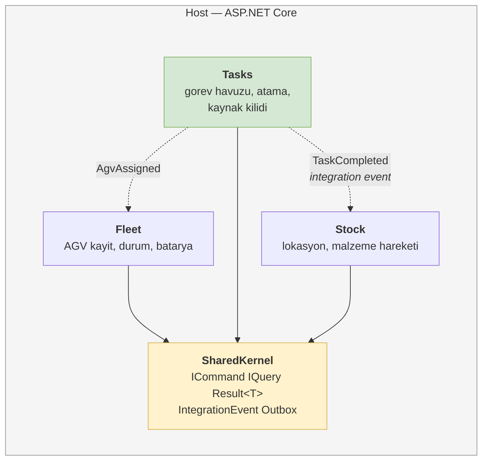
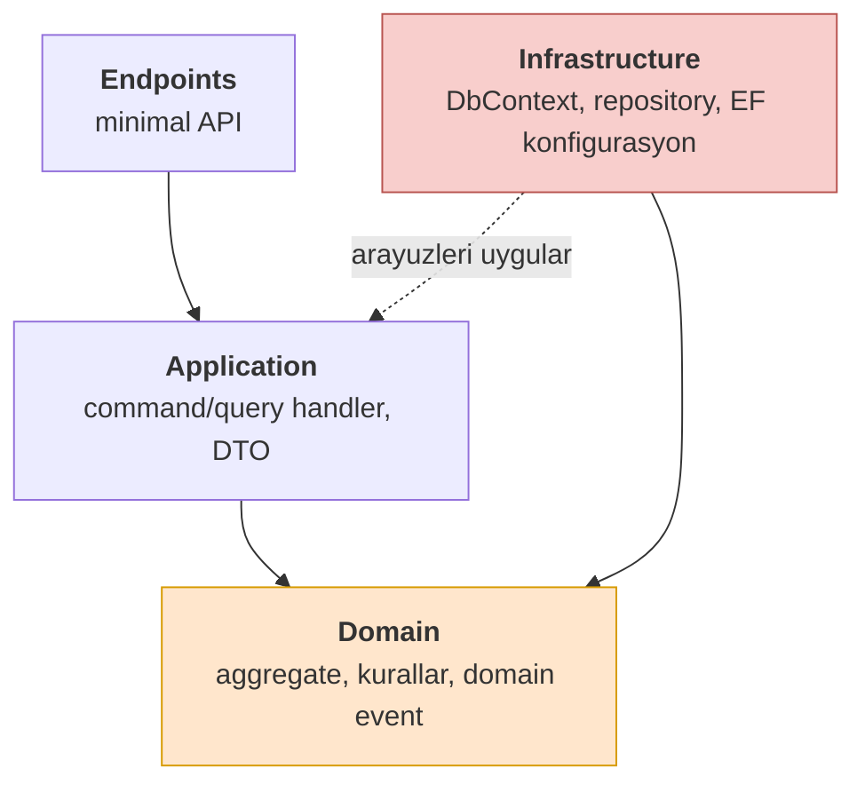
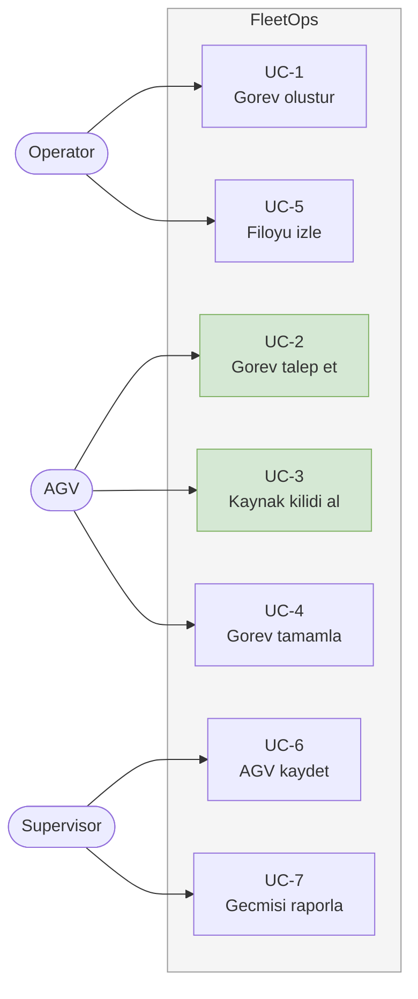
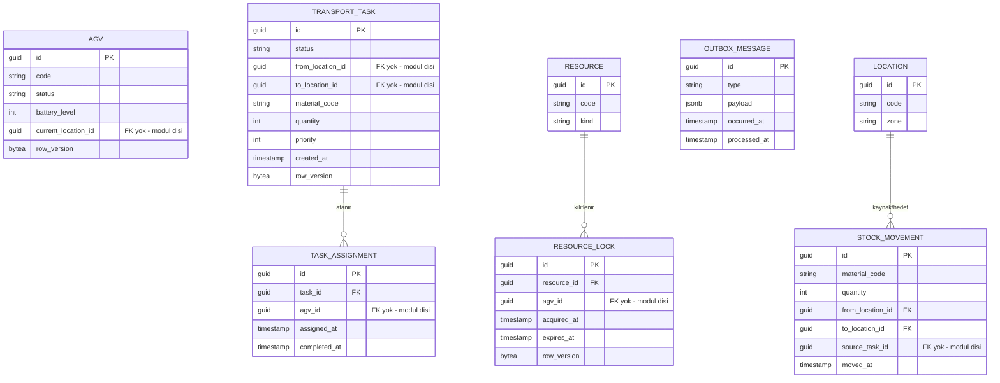
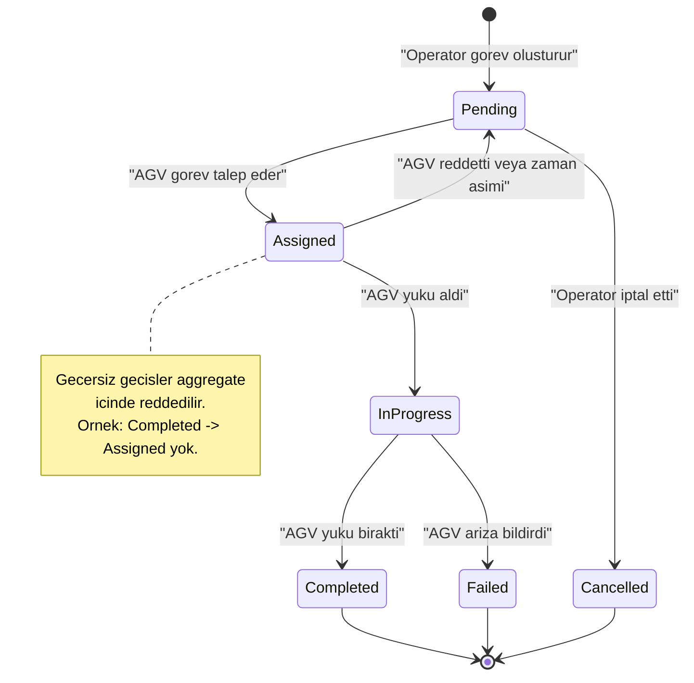
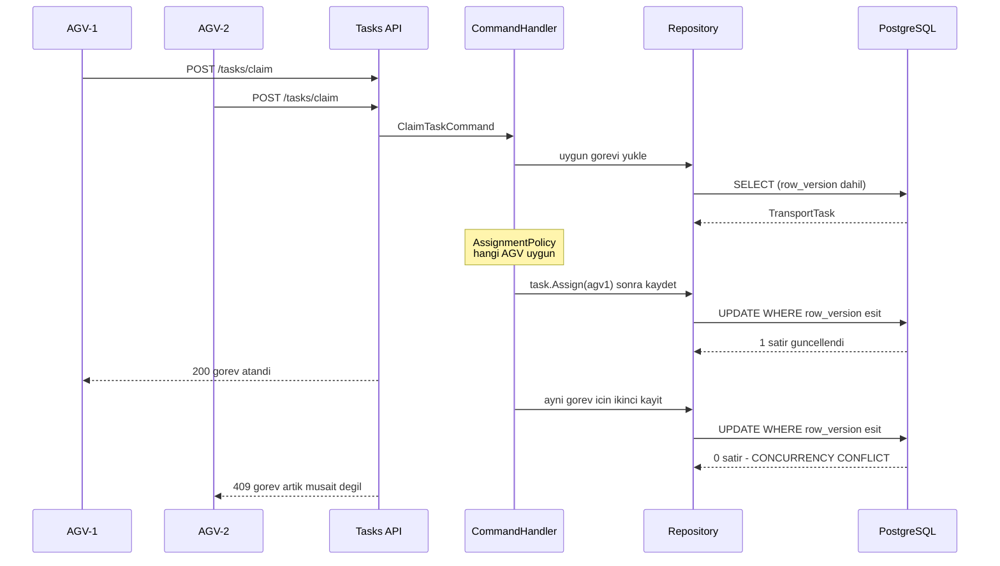
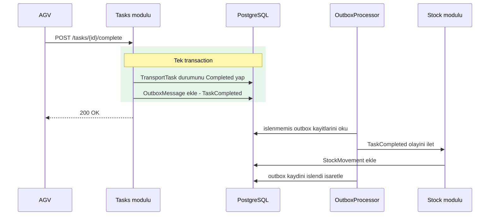
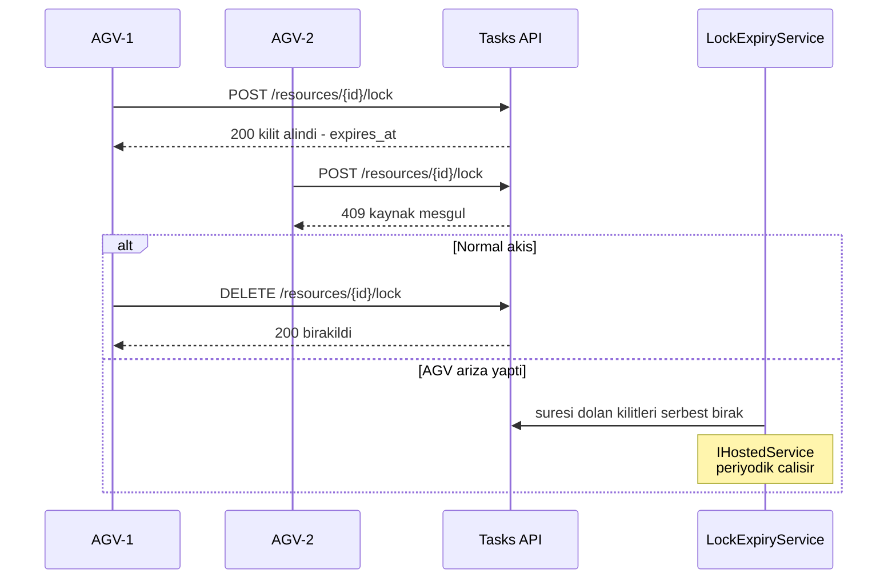
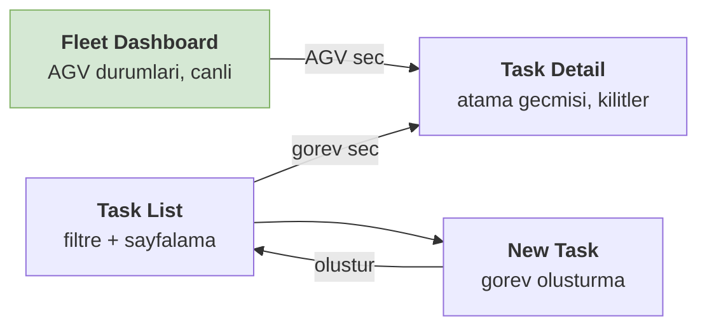

# FleetOps — Functional Analysis

## 1. Modül Haritası

### Modül kuralları

| Kural | Gerekçe |
|---|---|
| Modüller birbirinin `DbContext`'ini görmez | Her modülün kendi şeması ve migration'ı var |
| Modüller arası **foreign key yok** | Sadece ID ile referans; sınır veritabanı seviyesinde de korunur |
| Modüller birbirinin handler'ını çağırmaz | İletişim yalnızca integration event ile |
| Ortak olan her şey `SharedKernel`'de | Ama iş mantığı asla orada değil |

`Tasks` yeşil çünkü sistemin ağırlık merkezi orada: aggregate, concurrency,
kaynak kilidi ve outbox hep bu modülde.

## 2. Modül İçi Katmanlar

Her modül kendi içinde bu dört katmanı taşır. Bağımlılık yönü GameStore'daki ile aynı:
`Infrastructure` yukarı bakar, `Domain` hiçbir şeye bakmaz.

## 3. Aktörler ve Use Case'ler

Yeşil iki use case sistemin zor kısmıdır — ikisi de concurrency içerir.

| Aktör | Tanım |
|---|---|
| Operator | Görev oluşturur, filoyu izler |
| Supervisor | AGV kaydeder, politika ayarlar, rapor alır |
| AGV | Sistem aktörü; görev ister, kilit ister, durum bildirir |

## 4. Domain Sözlüğü

| Terim | Tanım |
|---|---|
| **Agv** | Filodaki bir araç. Durumu ve batarya seviyesi vardır |
| **TransportTask** | Bir noktadan diğerine malzeme taşıma işi. **Aggregate root** |
| **TaskAssignment** | Bir görevin bir AGV'ye atanması. Aggregate içinde yaşar |
| **Resource** | Aynı anda tek AGV'nin kullanabileceği fiziksel alan (koridor, kapı, asansör) |
| **ResourceLock** | Bir kaynağın bir AGV tarafından tutulması. Süre aşımına uğrar |
| **Location** | Alma/bırakma noktası (raf, istasyon) |
| **StockMovement** | Malzemenin bir lokasyondan diğerine geçtiğinin kaydı |
| **AssignmentPolicy** | Görevin hangi AGV'ye verileceğini belirleyen kural (**Strategy**) |

## 5. Veri Modeli

### Modül sahipliği

| Modül | Tablolar |
|---|---|
| **Fleet** | `AGV` |
| **Tasks** | `TRANSPORT_TASK`, `TASK_ASSIGNMENT`, `RESOURCE`, `RESOURCE_LOCK`, `OUTBOX_MESSAGE` |
| **Stock** | `LOCATION`, `STOCK_MOVEMENT` |

### Modeldeki dört karar

**`row_version` neden var?**
İki AGV aynı görevi aynı anda isteyebilir. `row_version` (PostgreSQL'de `xmin` veya
`bytea` concurrency token) sayesinde ikinci güncelleme çakışma hatası alır. Bu, projenin
en kritik garantisi.

**Modüller arası neden foreign key yok?**
`TRANSPORT_TASK.from_location_id` bir `LOCATION`'a işaret eder ama FK constraint yoktur.
Sebep: FK koyarsak `Tasks` ve `Stock` aynı şemayı paylaşmak zorunda kalır ve modül sınırı
veritabanı seviyesinde çöker. Referans yalnızca ID ile taşınır, tutarlılık uygulama
katmanında korunur.

**`OUTBOX_MESSAGE` neden `Tasks` modülünde?**
Outbox, olayı **üreten** modülün transaction'ına ait olmalı. Görev tamamlanma kaydı ile
"bunu duyur" niyeti aynı transaction'da yazılır.

**`TASK_ASSIGNMENT` neden ayrı tablo?**
Bir görev reddedilip yeniden atanabilir. Atama geçmişi verimlilik raporunun kaynağıdır.

## 6. TransportTask Yaşam Döngüsü

Durum geçişleri `TransportTask` aggregate'inin içinde uygulanır. Property'ler
`private set`'tir; durum yalnızca metotlarla değişir.

## 7. UC-2 — Görev Talebi ve Concurrency

**Kabul kriteri:** iki eşzamanlı istek sonrası veritabanında **tek** `TASK_ASSIGNMENT`
satırı bulunur. Bu, Testcontainers ile gerçek PostgreSQL'e karşı test edilir.

## 8. UC-4 — Görev Tamamlama ve Outbox

Yeşil kutu meselenin özü: durum değişikliği ile "bunu duyur" niyeti **aynı transaction**'da
yazılır. Uygulama arada çökerse outbox kaydı durur ve işlem tekrar denenir.

## 9. Kaynak Kilidi

Zaman aşımı olmasaydı arızalanan bir AGV koridoru kalıcı olarak bloke ederdi.
`IHostedService` bu senaryo için var — yapay bir gereksinim değil.

## 10. Fonksiyonel Gereksinimler

| # | Gereksinim | Modül | Use case |
|---|---|---|---|
| FR-01 | AGV kaydedilebilmeli, durumu güncellenebilmeli | Fleet | UC-6 |
| FR-02 | AGV batarya seviyesi bildirebilmeli | Fleet | UC-6 |
| FR-03 | Görev oluşturulabilmeli (kaynak, hedef, malzeme, öncelik) | Tasks | UC-1 |
| FR-04 | AGV bekleyen görev talep edebilmeli | Tasks | UC-2 |
| FR-05 | Bir görev aynı anda tek AGV'ye atanmalı | Tasks | UC-2 |
| FR-06 | Atama politikası değiştirilebilir olmalı | Tasks | UC-2 |
| FR-07 | AGV kaynak kilidi alabilmeli | Tasks | UC-3 |
| FR-08 | Bir kaynağı aynı anda tek AGV tutmalı | Tasks | UC-3 |
| FR-09 | Süresi dolan kilit otomatik serbest kalmalı | Tasks | UC-3 |
| FR-10 | Görev tamamlanabilmeli, geçersiz geçiş reddedilmeli | Tasks | UC-4 |
| FR-11 | Tamamlanan görev stok hareketi üretmeli | Stock | UC-4 |
| FR-12 | Filo durumu listelenebilmeli | Fleet | UC-5 |
| FR-13 | Filo durumu canlı güncellenmeli | Fleet | UC-5 |
| FR-14 | Görev geçmişi sayfalanabilir listelenmeli | Tasks | UC-7 |
| FR-15 | Operator ve Supervisor rolleri ayrılmalı | — | tümü |

## 11. Fonksiyonel Olmayan Gereksinimler

| # | Gereksinim | Ölçüt |
|---|---|---|
| NFR-01 | Görev talebi hızlı yanıtlamalı | < 200 ms |
| NFR-02 | Concurrency garantisi kanıtlanabilir olmalı | Gerçek DB'ye karşı eşzamanlı test |
| NFR-03 | Modül sınırı derleyici ile korunmalı | Modüller birbirinin projesine referans vermez |
| NFR-04 | Kurulum tek komutla yapılmalı | `docker compose up` |
| NFR-05 | Birim testler veritabanı gerektirmemeli | Domain testleri saf C# |
| NFR-06 | Migration dağıtımdan ayrı olmalı | Uygulama açılışında çalışmaz |
| NFR-07 | Sırlar kodda bulunmamalı | Ortam değişkeni |

## 12. Pattern Envanteri

| Pattern | Nerede | Çözdüğü problem |
|---|---|---|
| **Modular Monolith** | Çözüm yapısı | Stok mantığı ile filo mantığı karışmasın |
| **CQRS** | Her modül | Yazma aggregate'ten, okuma projeksiyondan |
| **Aggregate + rich domain** | `TransportTask` | Geçersiz durum geçişi imkânsız olsun |
| **Repository** | `ITransportTaskRepository` | Aggregate bir bütün olarak yüklensin/kaydedilsin |
| **Optimistic Concurrency** | `row_version` | Görev/kilit iki kez verilmesin |
| **State Machine** | Task yaşam döngüsü | Geçişler tek yerde tanımlı olsun |
| **Strategy** | `IAssignmentPolicy` | Atama kuralı değişebilir olsun |
| **Decorator** | `ICommandHandler` sarmalayıcıları | Log ve transaction handler'ı kirletmesin |
| **Outbox** | `Tasks` modülü | Kayıt gitti ama olay gitmedi durumu olmasın |
| **Integration Events** | Modüller arası | Modüller birbirini doğrudan çağırmasın |
| **Hosted Service** | `LockExpiryService` | Takılı kilitler serbest kalsın |
| **Options** | Kilit süresi, batarya eşiği | Ayarlar koda gömülmesin |

## 13. Ekranlar

## 14. Kabul Kriterleri

| # | Kriter |
|---|---|
| AC-1 | İki eşzamanlı görev talebinde biri 200, diğeri 409 alır; DB'de tek atama olur |
| AC-2 | Meşgul bir kaynağa ikinci kilit isteği 409 alır |
| AC-3 | Süresi dolan kilit, hosted service çalıştıktan sonra serbest olur |
| AC-4 | `Completed` bir görev tekrar `Assigned` yapılamaz — domain hatası döner |
| AC-5 | Görev tamamlandığında `STOCK_MOVEMENT` satırı oluşur |
| AC-6 | Outbox kaydı işlendikten sonra `processed_at` dolar |
| AC-7 | Operator rolü AGV kaydedemez — 403 alır |
| AC-8 | `docker compose up` sonrası örnek filo ve görevler arayüzde görünür |
